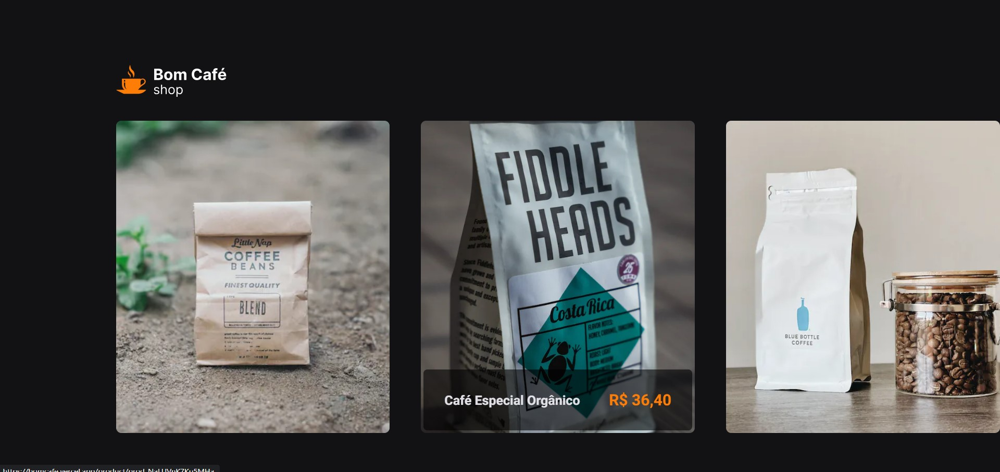
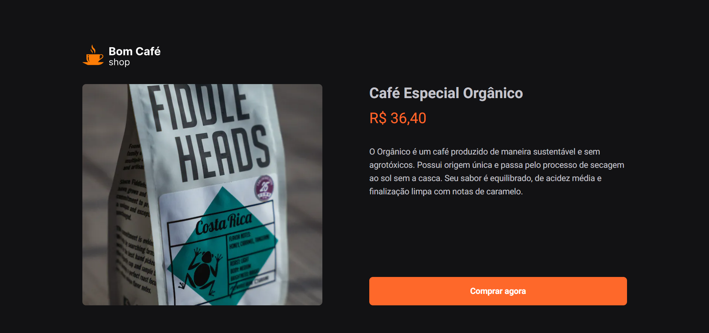
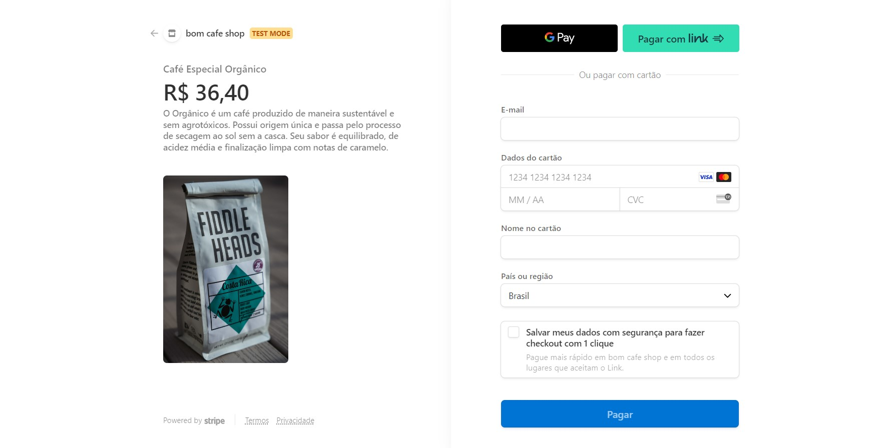
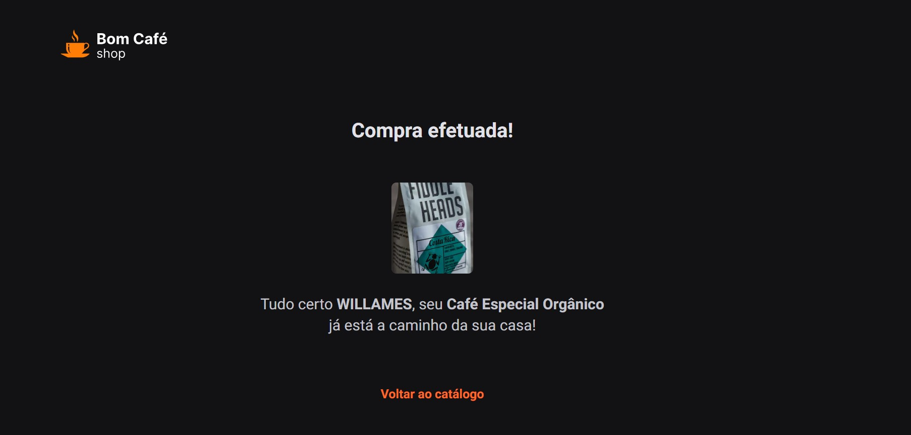

<div  style="width: 100%; text-align: center;">
    
</div>

<h1>Bom Café Shop</h1>

<p>Site de E-commerce desenvolvido em Next.js utilizando a api de pagamentos do stripe. O 
Objetivo deste projeto é criar um E-commerce para o produtor de café que quer 
comercializar seus cafés especiais produzidos, preparados e embalados para qualquer 
lugar do Brasil.</p>
<p><strong>Projeto em desenvolvimento.</strong></p>

<p>Acesse ao site <a href="https://bomcafe.vercel.app/">CLICANDO AQUI</a>.</p>

<h3>Tecnologias e Bíbliotecas</h3>

<ul>
    <li><a href="https://developer.mozilla.org/en-US/">HTML, CSS e TypeScript</a></li>
    <li><a href="https://nextjs.org/">Next.JS</a></li>
    <li><a href="https://stripe.com/br">Stripe</a></li>
    <li><a href="https://stitches.dev/">Stitches</a></li>
    <li><a href="https://axios-http.com/ptbr/docs/intro">Axios</a></li>
    <li><a href="https://keen-slider.io/">Keen Slider</a></li>
</ul>

<h3>Após clonar clonar o repositório, execute os comandos a seguir:</h3>

- Para baixar as dependências
```bash
npm install 
```
- Para executar a aplicação
```bash
npm run dev
```

<div style="display: grid; gap: 30px; grid-template-columns: repeat(auto-fit, minmax(300px, 1fr)); ">
    
    
    
    
</div>